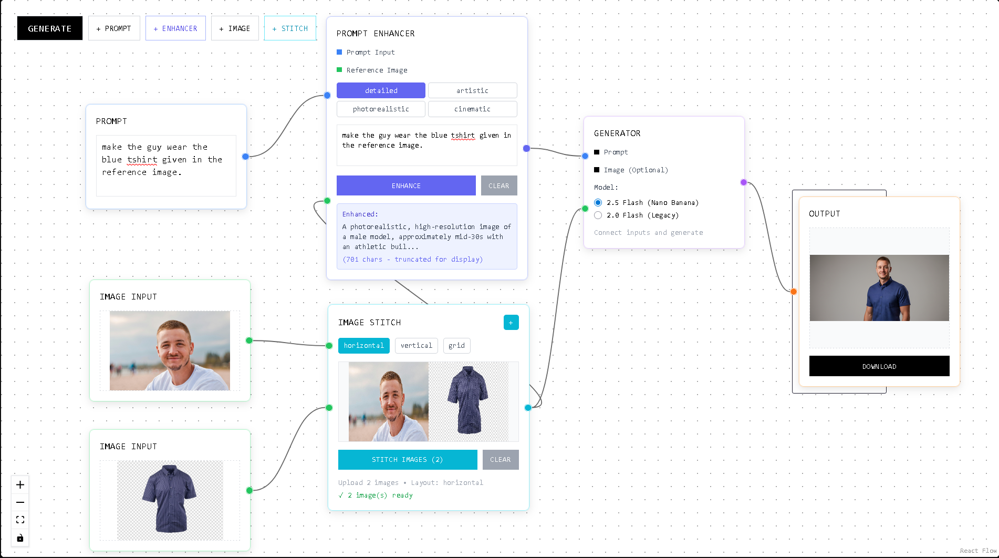

# VinciUI - Node-Based AI Image Generation

A beautiful, minimal node-based visual interface for AI image generation powered by Google's Gemini models.




## 🚀 Quick Start

### Prerequisites

- **Node.js** (v16 or higher)
- **npm** or **yarn**
- **Google AI API Key** (tier 1 available)
- if you only have free tier then you can't use flash 2.5 (nano banana) still could use flash 2.0 image preview (lagacy model) .
### Installation

1. **Clone the repository**
   ```bash
   git clone <repository-url>
   cd vinciUI
   ```

2. **Install dependencies**
   ```bash
   npm install
   ```

3. **Set up environment variables**
   
   Create a `.env.local` file in the root directory:
   ```bash
   # Create the environment file
   touch .env.local
   ```
   
   Add your Gemini API key to `.env.local`:
   ```env
   VITE_GEMINI_API_KEY=your_actual_gemini_api_key_here
   ```

4. **Start the development server**
   ```bash
   npm run dev
   ```

5. **Open your browser**
   
   Navigate to `http://localhost:5173` to see the application.

## 🔑 Getting Your Gemini API Key

1. Visit [Google AI Studio](https://aistudio.google.com/app/apikey)
2. Sign in with your Google account
3. Click "Create API Key"
4. Copy the generated API key
5. Paste it in your `.env.local` file

## 📝 License

This project is open source and available under the [MIT License](LICENSE).

## 🤝 Contributing

Contributions are welcome! Please feel free to submit a Pull Request.

---

**Built with ❤️**